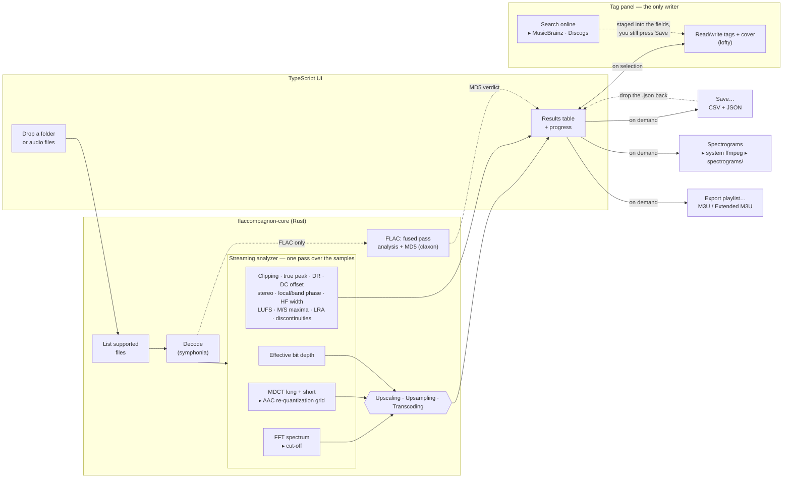

# FlacCompagnon

[](https://github.com/craft-and-code/FlacCompagnon/actions/workflows/ci.yml) [](https://github.com/craft-and-code/FlacCompagnon/actions/workflows/release.yml) [](https://github.com/craft-and-code/FlacCompagnon/actions/workflows/site.yml)

[](https://craft-and-code.github.io/FlacCompagnon/) [](https://craft-and-code.github.io/FlacCompagnon/doc/) [](https://github.com/craft-and-code/FlacCompagnon/releases/latest) [](LICENSE)

**A cross-platform desktop tool that checks whether your "lossless" audio is actually lossless.**

> [!NOTE]
> **Transcoding detection.** My sincere thanks to Olivier Derrien for agreeing to release his original MATLAB implementation of the transcoding detector as open source: [craft-and-code/lac-transcoded](https://github.com/craft-and-code/lac-transcoded). It has been fully reimplemented in Rust and integrated into FlacCompagnon. In current comparisons, FlacCompagnon identifies the files reported as transcoded by Lossless Audio Checker, as well as additional candidates. The two implementations are not identical, however, and their remaining differences and calibration are being reviewed with Olivier. A transcoding result is statistical evidence, not proof of a file's origin.
>
> The **Upscaling** detector (shown as **Upscaled** in the app) currently appears consistent with Lossless Audio Checker, but still needs broader validation on real-world material. The **Upsampling** detector also needs further work and validation. Audio engineers with Rust experience are warmly invited to contribute; help testing the algorithms against well-documented source material would be especially valuable.

> **About this project.** FlacCompagnon was built with an AI assistant, as an experiment: how far can AI-assisted development go on a real, non-trivial piece of software — signal processing, a native desktop app, tests, CI, documentation? It also serves as a working case study on how to use AI effectively: every detection algorithm was validated against independently computed ground truth (reference encoders, real files, bit-exact replicas) before being trusted, and the limitations that remain are documented rather than hidden. The transcoding detection implements the re-quantization method published by Olivier Derrien (JAES 67(3), 2019), who also shared his reference MATLAB implementation for this port; the wider tool it belongs to is described in _"Lossless Audio Checker: A Software for the Detection of Upscaling, Upsampling, and Transcoding in Lossless Musical Tracks"_ by Julien Lacroix, Yann Prime, Alexandre Remy and Olivier Derrien (AES 139th Convention, Paper 9416, 2015).

FlacCompagnon is a from-scratch, open-source successor to the discontinued _Lossless Audio Checker_. Drop a folder **or a single audio file** onto the window and it runs three independent authenticity detections — **Upscaling**, **Upsampling**, and **Transcoding** — verifies **FLAC MD5** signatures, measures spectrum, channel relationships, clipping, true peak, dynamics and loudness, and records suspected impulses and digital dropouts. It can also render a **spectrogram** for each track. The [analysis guide](docs/README.md) documents every result, its thresholds and its limits.

Beyond checking, it also **edits tags and cover art** (single files or whole selections at once, with an optional **MusicBrainz/Discogs** lookup) and **exports M3U playlists** in whatever order you arrange the table.

Built with **Rust** and **Tauri v2**, it compiles to a small native app for **Linux, Windows, and macOS**.

---

## What it does

### 1. Authenticity detections (Lossless Audio Checker model)

FlacCompagnon runs the same three **independent** detections as the original Lossless Audio Checker. A file can trip none, one, or several; if none fire it is reported **Clean**. The **Detections** column shows a coloured tag per finding, and hovering it explains the reasoning.

| Detection       | Meaning                                                                                                                                                                                                                                                                                                                                                               |
| --------------- | --------------------------------------------------------------------------------------------------------------------------------------------------------------------------------------------------------------------------------------------------------------------------------------------------------------------------------------------------------------------- |
| **Upscaling**   | Unused integer precision, or a persistent lower-depth quantization grid beneath low-level export noise. Grid-based depths are marked as estimates.                                                                                                                                                                                                                    |
| **Upsampling**  | Possible resampling: a high-rate container with limited bandwidth, which is an indicator rather than proof of origin.                                                                                                                                                                                                                                                 |
| **Transcoding** | Lossy source re-wrapped as lossless. Detected from the codec's own **quantization lattice**: rounding is irreversible, so a decoded lossy signal still sits exactly where its encoder put it, and re-wrapping it as FLAC preserves that. The statistical search can produce false positives, including on tonal signals. Missing checks are explained in the tooltip. |

See [Detection algorithms](#detection-algorithms) below for how each works, and its limitations. **Upscaling** measures zero low bits exactly and can estimate a lower-depth grid hidden by small residuals. **Transcoding** is statistical evidence requiring validation, while **Upsampling** remains a spectral heuristic. None of these checks certifies a recording's history.

A **search field** above the table filters which rows are shown — type a format, a bit depth, a detection name, anything a column displays. It only ever affects the display: playback order, the current selection, drag-reordering, and every export (CSV, JSON, M3U) all keep working off the full list, filtered or not.

**Right-click the header** to show or hide columns. To reorder the ones you've kept, press and hold a header cell and drag it left or right — the same gesture as dragging a row to reorder the list, just held a moment first so it doesn't collide with an ordinary click-to-sort. This includes **Quality** and **MD5**: both only ever appear when the data actually warrants them (a badge exists; a FLAC file is present), but where they show up in that order, like every other column, is yours to move. Columns added after your first run (see below) start hidden; anything you already had showing stays showing. The choice is remembered between launches. Alongside the always-computed columns, three more are available but hidden by default: **Codec** (the codec inside a multi-codec container — an M4A can hold ALAC or AAC, an OGG can hold Vorbis or Opus — blank when the container is already single-codec, like FLAC), **Bitrate** (the file's overall average, size × 8 ÷ duration — the same figure a tool like MediaInfo calls the "overall bit rate"), and **Modified** (the file's filesystem modification date). Seven tag fields can also be added as columns — **Artist, Album, Title, Track, Year, Genre** and **Encoder** (the tool that produced the file, when it left one behind, e.g. a FLAC's Vorbis vendor string or an MP3's ID3v2 `TSSE` frame) — read from the same tags already fetched for the tag panel, so turning one on doesn't trigger a new disk read. Reordering only changes what's on screen: the CSV export keeps its own fixed column order regardless (see below), so a script or spreadsheet reading it by position isn't affected by how you've arranged the table.

The **File** column supports Mp3tag/Finder-style inline renaming: click a row to select it, then click its name again (not a double-click) to edit it. Only the file's stem is editable — the extension is fixed and shown next to it as plain text, so a rename can never accidentally turn a `.flac` into a `.mp3` without actually transcoding it. **Enter** renames the file on disk; **Escape**, or clicking anywhere else, discards the edit and leaves the file untouched.

### 2. File fingerprints (MD5 + CRC32)

Every analyzed file also gets the **MD5 and CRC32 of its bytes** — tags and cover art included — computed in one read alongside its size and modification time. Two hidden-by-default columns, **File MD5** and **File CRC32**, show them; both are in the CSV and JSON reports, and both are searchable, so pasting a CRC32 out of an `.sfv` finds its file.

These answer a different question from the **MD5** column described next. This one identifies the _file as an object_ (checksum comparison, duplicate hunting, verifying a download); that one verifies the _audio_ against the signature FLAC stores in its own header, and is unaffected by retagging. A file can have an intact FLAC signature and still fail a `.sfv` check, and that is not a contradiction.

### 3. FLAC MD5 verification

Every FLAC file stores an MD5 hash of its decoded audio in the STREAMINFO block. FlacCompagnon reads it natively (no external `flac` binary required) and, by fully decoding the file, recomputes the hash to confirm the audio is intact — the same integrity check as `flac -t`.

The **MD5** column only appears when the analysis actually includes FLAC files, and reports one of:

- **OK** — signature present and the audio matches it.
- **Mismatch** — signature present but the audio does **not** match (corruption or a non-conforming encoder).
- **No signature** — the file was encoded without an MD5 (nothing to verify against).

### 4. Spectrogram generation

Click **Generate spectrograms** to render a spectrogram image for every track using **ffmpeg** installed on your system (resolved automatically at runtime — see prerequisites). The default **Small Size** uses a 900 × 470 spectrum canvas; **Large Size** in the **Spectrograms** menu uses 1800 × 940. The PNG is larger than the canvas because ffmpeg adds a legend. The menu only saves the preferred size; generation starts when you click the button. For each folder that contains audio, a `spectrograms/` sub-folder is created next to the files, and one PNG is written per track. The image includes a labelled **frequency axis** (its top equals Nyquist = sample-rate ÷ 2) and a caption spelling out the **sample rate**, bit depth, channel count, and format — so the cutoff and the sampling are visible at a glance.

### 5. Audio quality, channel and restoration checks

- **Spectral cutoff** — measures the highest frequency with appreciable averaged spectral content, plus the sharpness of the transition and the level above it. It is descriptive information, not a transcoding verdict.
- **Channel relationship** — flags exact or near dual-mono as **Fake stereo**; reports whole-track L/R correlation and a likely polarity inversion at correlation ≤ −0.95; reports unweighted RMS balance (`L +x.x dB`, `R +x.x dB`, or a silent channel); and measures high-frequency Side/Mid width as **HF Stereo**. This experimental cue measures 6–20 kHz (limited by Nyquist) against 1.5–5 kHz. Persistent narrowing can result from intensity stereo, but does not identify a codec or prove a defect. These measurements are available for two-channel material and describe the signal; they do not determine artistic intent.
- **Local and frequency-band phase** — reports minimum short-window L/R correlation in **Local phase** and across four frequency bands in **Band phase**. Hover for aggregate correlations, minimum locations, eligible coverage and opposed-window shares. These measurements reveal opposition hidden by a positive whole-track average. See [local phase](docs/local-phase.md) for the method and reproducible test audio.
- **Clipping** — counts full-scale sample runs (each _event_ = ≥3 consecutive samples at the normalized full-scale threshold) and reports the sample peak in dBFS. It is independent of whether the file is lossless.
- **DC offset** — measures the whole-file mean independently on each decoded channel. **DC (%)** shows the largest absolute mean as a percentage of full scale, with signed channel values on hover. Silence measures zero; short excerpts and incomplete low-frequency cycles can have a nonzero mean. See [DC offset](docs/dc-offset.md) for interpretation and test fixtures.
- **True peak** — reports the inter-sample peak in dBTP through 4× oversampling with a 48-tap polyphase FIR. A file can have clean stored samples yet reconstruct above 0 dBTP.
- **Dynamics (DR)** — estimates peak level against the RMS of the loudest 20% of sustained blocks. It describes crest factor in loud passages and is independent of losslessness.
- **Integrated loudness and LRA** — reports EBU R128-style integrated loudness in LUFS and loudness range in LU for valid mono or stereo streams. Silence, very short files and unsupported layouts have no reading.
- **Momentary and short-term loudness** — **LUFS-M max** and **LUFS-S max**, immediately after LUFS, show the loudest complete 400 ms and 3-second windows. Hover for their locations. Both reuse K-weighted power without gating and check every decoded frame. See [momentary loudness](docs/momentary-loudness.md) and [short-term loudness](docs/short-term-loudness.md) for calculations and test audio.
- **Impulses and dropouts** — counts conservative candidates for short click-like pulses and exact-zero gaps, with channel, timestamp and duration available on hover. These results point to places to audition; they are not corruption verdicts.
- **File size** — read straight from the filesystem by the Rust core, never derived from bitrate × duration, so it matches what your file manager reports for the same file. Displayed with **decimal** units (1 kB = 1000 bytes, as macOS Finder and most Linux file managers do); hovering the cell shows the exact byte count. Note that Windows Explorer labels _binary_ units "KB"/"MB", so it will show a slightly smaller number for the same file.

See the [analysis guide](docs/README.md) for one page per measurement, including formulas, thresholds, limitations, automated checks and manual fixtures.

### 6. Save & reload (on demand)

Analysis never writes anything by itself. When you want to keep the results, click **Save…** and pick a name and location — nothing is dropped into your music folders unless you ask for it. One dialog pick writes **two files, same stem, same folder**:

- a spreadsheet-friendly **`.csv`** — status, authenticity findings, lattice score, cutoff, bit depth, channel relationship, local and band phase evidence, HF Stereo, DC offset, clipping, true peak, LUFS, momentary/short-term maxima and their locations, LRA, dynamics, balance, suspected impulses/dropouts and their retained locations, FLAC MD5, codec, bitrate, modification time, and the two file fingerprints. The size is a raw byte count, so a spreadsheet can sum and sort it;
- a **`.json`** that round-trips the _entire_ analysis — every field, including the nested per-detection detail — so it can be reloaded later.

**Both files follow the table's row order**, including a manual drag-reorder. Beyond that the two behave differently on purpose:

|         | rows         | columns                                                                                                                                                                                                   |
| ------- | ------------ | --------------------------------------------------------------------------------------------------------------------------------------------------------------------------------------------------------- |
| `.csv`  | as displayed | **fixed order, always complete** — hiding or reordering columns on screen does not change the file. Tag columns (Artist, Album, …) are not exported: they come from the tag panel, not from the analysis. |
| `.json` | as displayed | every analysis field, always. A hidden column's value is still in there.                                                                                                                                  |

The JSON's completeness is not a formatting preference — it is what reloading depends on. A saved analysis that dropped whatever happened to be hidden at save time would lose data rather than merely look different.

To reload a saved analysis, **drop the `.json` file onto the window**, same gesture as dropping a folder — there's no separate button for it. The table renders instantly from the file, with no audio re-decoded. This also means the export reflects exactly what's on screen: rows removed with the trash icon before saving are **not** included in either file, and won't come back on reload.

### 7. Tag editing

Selecting rows opens a **tag panel** on the left — the one place in the app that can write to your audio files, and only when you click **Save** in that panel.

- **The usual fields**, Mp3tag-style: title, artist, album, album artist, composer, year, genre, track and disc numbers (with totals), comment, and a compilation flag.
- **Batch editing**: select several tracks and every field shows either the shared value or a **“multiple values”** badge. Only the fields you actually touch are written — the others are left exactly as they are on each file, so editing the album of 12 tracks never flattens their differing titles.
- **Renumbering**: select two or more tracks and click the renumber icon next to the search field to set Track to 1–N and Track Total to N across the selection, in the order shown in the table (not the order you clicked them in) — a confirmation dialog spells out exactly what will change before anything is written.
- **Cover art**, shown edge-to-edge at its own aspect ratio with a banner below carrying its dimensions/format/size and a **role picker** (_Front cover_, _Back cover_, _Artist_, …) — pick a different role to relabel the artwork without touching the image itself. When the selection holds several different covers, chevrons (and a 3 s auto-advance) cycle through them and the role picker is disabled (relabeling only makes sense when every selected file shares the exact same image). **Drop an image file onto the artwork** to replace the cover — as _Front cover_ — on every selected track. The extract button writes every distinct cover in the selection next to the audio as a plain image file — `cover.<ext>` for the first, `cover-2.<ext>`, `cover-3.<ext>`, … for the rest, so a selection with several genuinely different covers gets all of them instead of one overwriting the last.
- **Extended tags**: everything else present in the file (ISRC, BPM, ReplayGain, label, …) opens in its own pop-in, merged across the selection with the same "multiple values" handling. Click a row twice to edit its value; a grouped +/− adds a tag from a curated list of common fields for the file's format (lofty, the tagging library, can only write a known tag key, not an arbitrary custom one) or removes the selected row. Nothing is written until you press the pop-in's own **OK**, which only stages the change into the panel — the outer **Save** is still the one thing that ever reaches disk.
- **Search online** looks the release up on **MusicBrainz** and, optionally, **Discogs**, and pre-fills the panel from the result — see below.

Nothing is written until you press **Save**; **Reset** discards every pending change and re-reads the files.

#### Online lookup (MusicBrainz + Discogs)

This is the **only** feature that uses the network, and it only ever runs when you click **Search online** — never automatically, never in the background.

It picks the most precise starting point available:

1. If the files already carry a **MusicBrainz Release ID** (e.g. they were tagged with Picard), it goes straight to that exact release — no guessing.
2. Otherwise it searches using the **artist/album already in the tags**.
3. With no usable tags at all, it _suggests_ a query guessed from the **file name** (`01 - Artist - Title.flac`), shown for you to confirm rather than searched blindly.

Results from both sources are listed with a source badge. Picking one shows its track list and cover; **Apply** stages the values into the tag panel’s fields — it does not write anything, so you can review or adjust before pressing **Save** as usual. With a single track selected you can also click a track in the list to fill in its title and number; with several selected, only album-level fields are offered (there is no reliable way to guess which file is which track).

**Discogs** requires your own free personal access token (discogs.com → Settings → Developers), pasted once into the panel inside the search pop-in; it is kept locally in the app and never sent anywhere but Discogs. Without a token, only MusicBrainz is searched. **MusicBrainz needs no key.**

### 8. Playlist export (M3U)

Click the export-playlist icon next to the renumber icon (or use the **Export** menu) to write the current list to an M3U playlist, **in the order shown on screen** — including any manual reordering you did by dragging rows, and excluding rows you deleted with the trash icon. Two formats are offered, Extended by default:

- **Extended M3U** (`.m3u8`) — adds an `#EXTINF` line per track carrying its duration and `Artist - Title` (from the tags, falling back to the file name), so players show proper names without opening every file.
- **Simple M3U** (`.m3u`) — the paths only; understood by essentially everything.

Paths are written **absolute**, so the playlist plays from anywhere on the machine, but it will break if you later move the audio files.

### 9. Playback

Click the play icon on any row to preview it — no tag panel or selection required. A footer bar carries the transport: **Previous / Play-Pause / Next**, a seek bar (click or drag anywhere on the track), and a volume control (the slider stays hidden until you hover it, so it never crowds the seek bar; click the speaker icon to mute, click again to restore full volume).

Pressing the footer's Play button decides what to play next from the selection **at that moment**:

- **No selection** — starts at the top of the table and plays straight through to the end.
- **One row selected** — starts at that row and plays on to the end, same as no selection but for the starting point.
- **Several rows selected** — plays just that selection, in table order (skipping any unselected row in between), and stops once the last one finishes.

Previous/Next and the natural advance once a track finishes both follow whichever of those applies. That choice is made once, when Play starts — **changing the selection while something is already playing has no effect on the playback in progress**, only on the next time Play is pressed. Clicking the play icon on an individual row previews it directly (no tag panel or selection required) and follows the same rule for what it plays next.

### 10. Conversion

A second panel, mirroring the tag panel on the right, converts audio files to another format — entirely separate from the results table: what you drop into its own drop zone is analyzed for nothing, just converted. Open it from the toolbar's convert icon; the same **×** closes it as everywhere else.

- **Formats**: **FLAC** (lossless, the default), **Opus** (lossy, recommended — free and efficient), **MP3** (lossy, for players/hardware that don't speak Opus), and **WAV** (uncompressed 16-bit PCM — a guaranteed-honest copy, useful for a file this app has flagged as fake-lossless). All four are royalty-free: FLAC and WAV need no codec license at all, Opus was designed royalty-free from the start, and MP3's patents have all expired. Opus and MP3 offer a bitrate picker; "Auto" uses a sensible default (160 kbps for Opus, 256 for MP3).
- **One click converts everything imported.** Click a row in the imported list to toggle it; with at least one row toggled, the button switches to converting just that selection instead.
- Converting asks for a **destination folder**, then **mirrors the source folder structure** underneath it — sub-folders and all — with each file's extension swapped for the new format's.
- **Tags and cover art follow the file** into whichever format you convert to — title, artist, album, track and disc numbers, year, genre, comment, compilation flag, embedded artwork, and any extended tags. A file that converts but whose tags couldn't be carried over is reported separately from a failure, since the audio is there and playable.
- **FLAC gets a compression setting** — _Fast_, _Balanced_ (the default) or _Maximum_ — which trades encoding time against file size. It never touches the audio: all three decode back to the exact original, bit for bit. These are deliberately not libFLAC's `-0`…`-8`: the encoder here is the pure-Rust `flacenc`, so borrowing those numbers would imply an equivalence the output doesn't have.
- **"Also copy other files"** copies everything else that shares a source folder — covers, `.m3u` playlists, generated spectrograms, anything — to the same destination, unconverted. It's all-or-nothing: there's no per-file picker.
- **"Keep original file dates"** stamps each converted file with its source's last-modified date, so the copies sort by date the way the originals did. Applies to every format, not just FLAC — it's a property of the file written, not of the codec.
- The drop zone animates while a batch runs, and the **whole app is frozen** for the duration (only the panel's own Cancel button stays live) — nothing else needs CPU cycles while your machine is busy encoding, and if a track was playing it's paused automatically first.

Converting never touches your original files — it only ever writes new ones under the destination folder you pick. **DSD sources (`.dsf`/`.dff`) aren't convertible yet** (the fast decode path this feature uses doesn't handle DSD — only the separate ffmpeg-backed analysis path can); a DSD file dropped in reports a clear per-file error rather than being silently skipped. Opus and MP3 only accept a handful of fixed sample rates, so a hi-res source (88.2/96/176.4/192 kHz) is resampled first with a plain linear interpolator — good enough given how much both codecs' own psychoacoustic coding already discards, but not a mastering-grade resampler.

---

## Supported formats

FLAC, WAV, AIFF, ALAC/MP4 (`.m4a`), CAF, OGG/Vorbis, MP3, AAC, and **DSD** (`.dsf` / `.dff`). MP3/AAC are decoded so you can compare them, though they are lossy by definition. DSD container headers are verified natively; DSD _content_ analysis requires ffmpeg (DST-compressed DFF is header-only).

### Opus and APE: waiting on Symphonia

Two formats people reasonably expect are **not analyzable**, and in both cases the blocker is the same one — [Symphonia](https://github.com/pdeljanov/Symphonia), the decoding library this app is built on, cannot decode them. Neither is something FlacCompagnon can fix on its own.

- **Opus** — Symphonia lists the codec at status `-` ("in work or not started yet"), and `symphonia-codec-opus` is a placeholder crate that the `all` feature doesn't even pull in. Symphonia _identifies_ Opus streams happily, so a `.opus` file (or an Opus stream inside a `.ogg`) is accepted, probed, and then fails with an explicit "Opus decoding is not supported yet" rather than a bare "unsupported codec". Note the asymmetry this creates: **conversion _to_ Opus works**, because the encoder path uses libopus directly and never goes through Symphonia. The app can write a format it can't read back.
- **APE (Monkey's Audio)** — Symphonia has no APE demuxer or decoder at all ([issue #469](https://github.com/pdeljanov/Symphonia/issues/469)). Beware a confusing coincidence of naming: Symphonia _does_ read **APEv1/APEv2 tags**, which is a metadata format that happens to share the name and has nothing to do with the codec. APE is also absent from the conversion targets, and that part is unlikely to change: the only reference encoder is the original C++ SDK, there is no Rust one, and FLAC already does the same lossless job with far better support.

If either becomes worth doing before Symphonia ships its own:

- Opus could go through [`symphonia-adapter-libopus`](https://crates.io/crates/symphonia-adapter-libopus) — version **0.2.7** is the last one built against `symphonia-core` 0.5, which is what this project uses (0.3.0 requires 0.6). Untested caveat: it depends on `opusic-sys` while the encoder already links libopus through `audiopus_sys`, and two `-sys` crates claiming the same native library can refuse to link.
- APE input could go through [`ape-decoder`](https://crates.io/crates/ape-decoder), pure Rust, no `unsafe`, all compression levels — it would need registering as a third-party decoder rather than dropping into `symphonia::default`.

---

## How it works



<sub>Analysis only ever reads your audio. The CSV/JSON report, the spectrogram PNGs and the M3U playlist are written only when you ask, and never inside your audio files. The tag panel is the single path that writes to a track, and only on its explicit <b>Save</b> — the audio stream itself is never re-encoded. <b>Search online</b> is the only feature that touches the network, and only on an explicit click.</sub>

The project is a Cargo workspace with two crates:

- **`core/`** — a pure-Rust library (`flaccompagnon-core`) containing all the analysis. It has no UI dependency and is fully unit-tested.
- **`src-tauri/`** — the Tauri desktop app that wraps the core and exposes it to the web frontend.

---

## Detection algorithms

These mirror the three tests described by the authors of the original Lossless Audio Checker, Julien Lacroix & Yann Prime, in their AES papers (see [references](#references)). FlacCompagnon is an independent re-implementation of the _principles_ — the transcoding implementation was compared with the author-provided MATLAB reference and papers; its thresholds remain tunable in `core/`.

**Upscaling (integer precision).** Every decoded integer sample from every channel is checked through the end of the file. Always-zero low bits identify exact padding. A second, conservative check recognizes a lower-depth quantization grid beneath small residuals, including the supplied Audacity 16-to-24-bit export. It requires varied audio in several windows per channel; any out-of-band sample vetoes that grid. **Real bits** shows exact depth or a marked estimate such as **≈16-bit**. JSON and CSV retain exact occupied bits and the measurement method. The historical silence convention remains **1 bit**, with a binary Upscaled verdict. A negative finding does not prove native resolution: noise or processing can erase the grid. See [method, sources, tests and limits](docs/upscaling.md).

**Upsampling (bandwidth heuristic).** The verdict uses the MDCT high-frequency dead zone, independently of the displayed FFT cutoff. At rates above 48 kHz, it flags a dead zone in at least 70% of analyzed MDCT frames, a mean cutoff below 90% of Nyquist and at most 30 kHz, and a mean dead-zone level below −75 dB relative to the frame peak. These are heuristic thresholds, not a certainty test. Native recordings subjected to low-pass filtering can trigger the same result; added ultrasonic noise can hide a resampled source. The detail therefore says “Possible upsampling”. Neither this test nor a spectrogram can establish the history of two identical signals.

**Transcoding (lossy source).** A port of Olivier Derrien's method (JAES 67(3), 2019 — see [references](#references)), reimplemented in Rust from the papers and from the author's own MATLAB, which he shared for this purpose.

The idea in one sentence: a lossy encoder quantizes its transform coefficients onto a lattice, and decoding to PCM does not move them off it. So the detector reproduces the codec's analysis chain, scales each scalefactor band by a candidate scalefactor, rounds, and measures how far the coefficients had to move. The statistical model assumes uniform rounding error on genuine lossless audio (an assumption that can fail on tonal or near-silent signals); on a transcode it collapses toward zero, because the values were already on the grid.

Two codecs are searched, and both must be, because they look in different transforms — a file the AAC sweep calls clean can still be an MP3 transcode:

- **AAC** — MDCT straight onto the PCM, 2048-sample long windows and 256-sample short ones, four window shapes, all **1024** sample alignments. Only the encoder's exact alignment makes the coefficients snap back onto the lattice; one sample off and the effect is gone.
- **MP3** — the hybrid filterbank: a 512-tap polyphase bank into 32 subbands, an 18-point MDCT per subband, then the alias-reduction butterflies. **576** alignments, one granule.

Each codec keeps its own parameters (scalefactor bias, δ range, significance threshold) as the standards and the author's tuning define them; they are not interchangeable. The score is the fraction of (band, scalefactor) trials whose rounding error fell below its statistical threshold, pooled across selected frames after choosing each frame's best window shape, then maximised over alignments and tested channel modes (L/R/M/S). It runs at 32/44.1/48 kHz, the rates the scalefactor band tables cover.

> [!WARNING] **Calibration is preliminary.** AAC uses 64 frames × 64 scalefactors and λ = 0.0125; MP3 uses 8 × 8 and the provisional λ = 0.031. Both now reuse one frame selection across channel modes. A detector that lacks its full frame count abstains rather than reusing its threshold on fewer observations. Rejecting all-zero quantization trials changes the statistic and needs corpus validation of sensitivity as well as false positives. A pure lossless 24-bit sine can still cross the AAC threshold. The score is not proof of provenance.

The score is exported in the CSV as `lattice_score`, and shown in the Detection column's tooltip. An empty value means the search did not complete — which is not the same as a low score — and the tooltip gives the reason (untabulated sample rate, file too short, decode failure, cancelled).

The spectral cut-off is still **measured and displayed**, but no longer produces a verdict. A sharp drop below Nyquist is consistent with a lossy low-pass, and equally consistent with an acoustic master, a 1960s tape or a deliberately filtered signal; no threshold separates them. It is information, not an accusation.

**DSD authenticity (fake-DSD detection).** DSF/DFF headers are parsed natively (magic bytes, 1-bit rate → DSD64/128/256, channels, DST flag) — that authenticates the container exactly. The content check decodes the stream through ffmpeg and looks for a _digital brick wall_ at a PCM source's Nyquist frequency: genuine DSD blends smoothly into the sigma-delta noise shaping (measured ≈ 3 dB step across 22.05 kHz on ground-truth files synthesized with a delta-sigma modulator), while DSD converted from 44.1/48 kHz PCM shows a ≈ 50 dB cliff there. A drop ≥ 30 dB flags the file as **Upsampled** (PCM-sourced DSD).

**Verified quality badges.** Files earn a small badge next to their format — **Hi-Res** for PCM above 48 kHz or 16-bit, **DSD64/128/256** for DSD — but only when no detection contradicts the claim (no upscaling, no upsampling, no transcoding). These are custom chips, not the official trademarked DSD / Hi-Res Audio logos, and unlike those logos they are backed by the analysis: a 96 kHz file that is really an upsampled CD gets flagged, not badged. A grey `?` badge means the container is authentic but the content could not be analyzed (no ffmpeg).

### Known limitation: naturally "dark" recordings

All cut-off-based detection assumes genuine music has energy up near Nyquist. Acoustic, classical and older (ADD / analog-tape) recordings often have almost nothing above ~16–18 kHz _by nature_, so their spectrum rolls off early. This used to make them read as **Transcoded?**, which is why that verdict no longer exists: the transcoding test now looks only for a codec's quantization lattice, which a dark master does not have. The cut-off is still shown, and the spectrogram is still the place to look when something seems off.

---

## Getting started

### Prerequisites

- [Rust](https://rustup.rs/) (stable) and Cargo.
- [Node.js](https://nodejs.org/) 18+ and npm.
- Tauri v2 system dependencies for your OS — see <https://v2.tauri.app/start/prerequisites/> (on Linux: `webkit2gtk`, `libayatana-appindicator`, etc.).
- **autoconf, automake and libtool** — build-time only, for the Opus encoder. The `audiopus_sys` crate compiles a vendored libopus with the autotools, so `autoreconf` has to be on `PATH` or the build stops at "Failed to autogen Opus". Most Linux setups already have them; macOS does not:
  - macOS: `brew install autoconf automake libtool`
  - Debian/Ubuntu: `sudo apt install autoconf automake libtool`
- **ffmpeg** — only needed for the spectrogram feature. Install it with your package manager:
  - macOS: `brew install ffmpeg`
  - Debian/Ubuntu: `sudo apt install ffmpeg`
  - Windows: `choco install ffmpeg` (or download from ffmpeg.org and add it to `PATH`)

`ffmpeg` is located automatically at runtime (it checks `PATH` plus common install locations such as Homebrew's `/opt/homebrew/bin`). If it lives somewhere unusual, point the app at it with the `FLACCOMPAGNON_FFMPEG` environment variable. Analysis, MD5 verification, and reports do **not** require ffmpeg for FLAC/WAV/AIFF/ALAC/CAF/OGG/MP3/AAC — only spectrogram rendering does. **DSD (`.dsf`/`.dff`) is the one exception**: its container header is always verified natively, but the content-level checks (dynamic range, clipping, cutoff, and the real-DSD-vs-PCM-sourced authenticity check) need ffmpeg to decode the 1-bit stream. Without it, a DSD file only gets header verification and its quality badge is marked "(unverified)".

**Optional, for the online tag lookup:** a free [Discogs personal access token](https://www.discogs.com/settings/developers) if you want Discogs results alongside MusicBrainz. It's pasted into the search pop-in once and stored locally. MusicBrainz needs no key, and the whole feature is optional — the app works fully offline without it.

### Notable dependencies

Nothing links against a system library: the two C codecs used for conversion (libopus, LAME) are vendored and built from source, so a finished binary needs nothing installed beyond Tauri's own runtime prerequisites (and the optional ffmpeg above). Building one, on the other hand, needs the autotools listed under Prerequisites — libopus is configured with them.

| Crate                                                                                           | Used for                                                                                                                                                            |
| ----------------------------------------------------------------------------------------------- | ------------------------------------------------------------------------------------------------------------------------------------------------------------------- |
| [`symphonia`](https://crates.io/crates/symphonia) / [`claxon`](https://crates.io/crates/claxon) | Audio decoding; `claxon` also drives the fused FLAC + MD5 pass.                                                                                                     |
| [`lofty`](https://crates.io/crates/lofty)                                                       | Reading and writing tags and cover art across every supported container.                                                                                            |
| [`cpal`](https://crates.io/crates/cpal)                                                         | Audio output for in-app playback (footer transport, click-to-preview from the table).                                                                               |
| [`reqwest`](https://crates.io/crates/reqwest)                                                   | The online tag lookup — the only crate here that touches the network. Uses **rustls**, so no system OpenSSL is required.                                            |
| [`base64`](https://crates.io/crates/base64)                                                     | Moving cover-art bytes between the Rust core and the webview.                                                                                                       |
| [`flacenc`](https://crates.io/crates/flacenc)                                                   | Conversion panel's FLAC encoder — pure Rust, no C toolchain required.                                                                                               |
| [`hound`](https://crates.io/crates/hound)                                                       | Conversion panel's WAV encoder (also used by the test suite's own WAV fixtures).                                                                                    |
| [`audiopus`](https://crates.io/crates/audiopus) / [`ogg`](https://crates.io/crates/ogg)         | Conversion panel's Opus encoder (`audiopus` wraps `libopus`) and the Ogg container muxing around it (`ogg`, pure Rust) — Opus packets alone aren't a playable file. |
| [`mp3lame-encoder`](https://crates.io/crates/mp3lame-encoder)                                   | Conversion panel's MP3 encoder, wrapping LAME.                                                                                                                      |

### 1. Install dependencies

```bash
npm install
```

### 2. Run in development

```bash
npm run tauri dev
```

### 3. Build a release bundle

```bash
npm run tauri build
```

The installer/app bundle is written to `src-tauri/target/release/bundle/`.

> **Cross-platform note:** native desktop apps are normally built **on** their target OS. Build the Windows app on Windows, the macOS app on macOS, and the Linux app on Linux. The easiest way to produce all three from one place is a CI matrix (e.g. GitHub Actions) that runs `npm run tauri build` on `windows-latest`, `macos-latest`, and `ubuntu-latest`.

---

## Continuous integration & releases

Four GitHub Actions workflows are included:

- **CI** (`.github/workflows/ci.yml`) runs on every push and pull request: it runs the `core` test suite, type-checks and bundles the frontend, and compiles the whole Rust workspace on Linux. The badges at the top of this README reflect its status.
- **Docs** (`.github/workflows/docs.yml`) and **Site** (`.github/workflows/site.yml`) publish, respectively, the rustdoc API reference and the static landing page to the `gh-pages` branch (see [Documentation](#documentation-rustdoc) below for the one-time Pages setup).
- **Release** (`.github/workflows/release.yml`) builds installers for **macOS (Apple Silicon), Windows and Linux** and publishes them to a GitHub Release. It runs when you push a version tag:

  ```bash
  git tag v0.1.0
  git push origin v0.1.0
  ```

(or from the Actions tab via "Run workflow"). The release is created as a **draft** — review the attached installers, then publish it. Your downloads then live on the repository's **Releases** page. ffmpeg is not bundled; users install it themselves for the spectrogram feature.

**Every artifact name ends with its platform**, so there is no guessing on the Releases page:

| Your system                | File to download                                 |
| -------------------------- | ------------------------------------------------ |
| Windows 10/11 (64-bit)     | `FlacCompagnon_<version>_Windows-x64.msi`        |
| macOS (Apple Silicon)      | `FlacCompagnon_<version>_macOS-AppleSilicon.dmg` |
| Linux (any distro, 64-bit) | `FlacCompagnon_<version>_Linux-x86_64.AppImage`  |
| Linux (Debian / Ubuntu)    | `FlacCompagnon_<version>_Linux-x86_64.deb`       |

The macOS `.app.tar.gz` is the same application as the `.dmg`, just archived. The release workflow builds with `tauri-action`, renames each artifact with its platform label, then uploads the set as a **draft** release.

### Installing on macOS (unsigned build)

These builds are **not signed with an Apple Developer ID** (that needs a paid, $99/year Apple Developer account and notarization). macOS therefore quarantines the downloaded app and Gatekeeper reports that FlacCompagnon _"is damaged and can't be opened"_ or that the developer _"cannot be verified"_ — offering only to move it to the Trash. This is expected, not a corrupt download.

To run it: drag **FlacCompagnon.app** into `/Applications`, then clear the quarantine flag once:

```bash
xattr -dr com.apple.quarantine /Applications/FlacCompagnon.app
```

Alternatively, right-click the app → **Open** → **Open**, or approve it under **System Settings → Privacy & Security**. To remove the warning entirely, the app would need to be code-signed and notarized with an Apple Developer ID.

## Testing

All analysis logic lives in the `core` crate and is covered by unit and integration tests (the integration tests synthesize WAV files with known spectral properties and assert the detections; `mdct` has its own correctness tests):

```bash
cargo test -p flaccompagnon-core
```

Tag reading/writing and playlist building are tested there too — the tag tests write to real temporary files and read them back, so the round trip is exercised end to end rather than mocked. The Tauri crate adds tests for the online lookup's ID validation:

```bash
cargo test            # the whole workspace
```

### Probing one real file by hand

The transcoding detectors are the hardest part to reason about from a test suite alone: they need real transcodes, which cannot live in the repository. `core/examples/probe.rs` runs them on a single file and prints what each codec found, without going through the app:

```bash
cargo run --release -p flaccompagnon-core --example probe -- "/path/to/track.flac"
```

It reports the likelihood, the winning sample alignment and the verdict for **both** the AAC and MP3 sweeps, plus per-channel MP3 scores. Use it when the app's Detection column says something surprising — it runs the same detector code, so it separates "the algorithm is wrong" from "the app I am running was built before the algorithm changed". `--release` matters: a debug build takes minutes.

The **network is never touched by the test suite**: the lookup's HTTP calls are not exercised, only the pure input-validation around them, so `cargo test` stays fast and works offline.

---

## Documentation (rustdoc)

The whole `core` crate is documented with Rust doc comments (crate-, module- and function-level), so you can browse the full API — every analysis routine, its inputs and its heuristics — as a generated HTML site. Build it locally with:

```bash
cargo doc -p flaccompagnon-core --no-deps --open
```

On every push to the main branch the `Docs` workflow (`.github/workflows/docs.yml`) builds this documentation and publishes it into the `doc/` sub-folder of the `gh-pages` branch, so it can live alongside a static presentation site served from the root of the same branch (neither overwrites the other). Enable it once under **Settings → Pages → Source: Deploy from a branch → `gh-pages` / (root)**; the API docs are then served at <https://craft-and-code.github.io/FlacCompagnon/doc/>.

---

## Output layout

Analysis alone writes **nothing**. The only files FlacCompagnon creates are the spectrogram PNGs (_Generate spectrograms_), the CSV + JSON report pair (_Save…_), and an M3U playlist (_Export playlist…_) — each written only where you point it. For a dropped folder:

```
My Album/
├── 01 - Track.flac
├── 02 - Track.flac
└── spectrograms/         ← only created when you generate spectrograms
    ├── 01 - Track.png
    └── 02 - Track.png
```

Sub-folders that contain audio each get their own `spectrograms/` folder next to their files.

### Your audio is only ever modified when you ask

**Analysis never writes to your files.** Every track is opened **read-only** to decode and measure it; the MD5 check reads the FLAC and recomputes the hash in memory without altering anything. Dropping, analyzing, generating spectrograms, saving a report and exporting a playlist all leave your audio byte-for-byte untouched.

There are **two** exceptions, both explicit, deliberate actions that never happen automatically:

- The tag panel's **Save** button writes the tags (and cover art) you edited back into the selected files — only the fields you actually changed are written, and the **audio stream itself is never re-encoded or touched**, only the metadata container around it.
- Renaming a file from the results table (click twice on its name, see [above](#1-authenticity-detections-lossless-audio-checker-model)) changes its name on disk — again, only its name: the audio and its tags are untouched.

If you want the guarantee that nothing can ever be written, simply don't use the tag panel's Save button and don't rename any file — every other feature is read-only.

The **conversion panel** (see [above](#10-conversion)) is a separate case: it always writes **new** files, under a destination folder you explicitly pick each time — the sources it reads from are never modified or moved.

### Network use & privacy

FlacCompagnon works **fully offline**. The single feature that makes a network request is the tag panel's **Search online** button, and only on that click:

- Requests go to **MusicBrainz**, the **Cover Art Archive**, and — only if you configured a token — **Discogs**. Nowhere else.
- What is sent is the **search text** (artist/album, or a release ID already in your tags). **No audio, no file paths, no file contents, and no identifying information about you** ever leave the machine.
- There is **no telemetry, analytics, crash reporting or update check** anywhere in the app.
- Your Discogs token is stored locally by the app and is only ever sent to Discogs.

Requests carry a descriptive `User-Agent` (as MusicBrainz's usage policy requires), time out after 20 s, and downloaded cover images are size-capped.

---

## Limitations & notes

- **Upsampling** remains a heuristic and can misfire on unusual material; a spectrogram cannot prove the original sample rate. **Transcoding** is a statistical test with known tonal false positives and a provisional calibration. **Upscaling** measures unused integer bits exactly; its additional grid estimate can miss processed sources or flag deliberately grid-like material.
- **AAC transcode detection covers all bitrates at 44.1/48 kHz** (validated on real 128/192/256/320 kbps AAC→FLAC transcodes against their originals: zero false positives, 24/24 recall, including transient-dense content via the short-block analysis). **MP3 sources** are still only caught through the spectral brick-wall signature, so high-bitrate MP3 (320 kbps) can pass — MP3 uses a different filterbank (hybrid PQMF + 576-point MDCT) and would need its own re-quantization detector.
- Integer bit-depth analysis preserves decoded PCM through 32 bits without a float round-trip. Floating-point sources have no integer precision verdict.
- FLAC files are decoded **once**: a fused pass feeds the analysis and hashes the MD5 from the same raw integer samples (bit-identical to `flac -t`), so MD5 verification adds only a negligible hashing cost on top of the analysis.
- Files are analyzed **in parallel**: a worker pool sized to the machine (one worker per CPU core, minus one to keep the UI responsive) processes independent files concurrently, so analyzing an album scales with your core count.
- **Extended tags only offer a curated list of fields to add**, not a free-text custom key. lofty (the tagging library) can only write one of its own known tag keys, not an arbitrary made-up frame the way some tools' TXXX editors can, so a free-text field would silently do nothing for a name it doesn't recognize.
- **The online lookup matches by text, not by audio.** It uses an existing MusicBrainz ID when the files carry one, otherwise the tags, otherwise a guess from the file name. It does **not** fingerprint the audio, so a badly-named, untagged file may need the query typed by hand.
- **Playlists store absolute paths**, so they survive being opened from anywhere on the machine but break if the audio files are moved afterwards.
- **Conversion's WAV output is fixed at 16-bit PCM**, not the source's own bit depth (unlike FLAC output, which preserves it) — deliberately, to keep the encoder call unambiguous; 24-bit WAV output may follow later. **AIFF is not offered** as a conversion target despite early planning around "WAV/AIFF" — WAV alone already covers the "guaranteed-honest PCM copy" use case, and adding a second PCM container didn't carry its own weight.
- **Conversion doesn't support DSD sources** (`.dsf`/`.dff`) yet — see [Conversion](#10-conversion) above.

## Roadmap ideas

Easy future additions (the analyzer is modular): per-channel spectral analysis and ReplayGain scanning. The separate **HF Stereo** measurement now reports a high-band Side/Mid collapse when the upper-mid reference remains wide. It is still an experimental quality indicator until it has been measured against a labelled corpus of real music. The transcode detector is already _robust to_ joint-stereo coding — it tests the L, R, M and S representations, so an M/S-coded transcode is still caught; HF Stereo describes the resulting stereo width rather than codec provenance.

On the tagging side: **AcoustID/Chromaprint audio fingerprinting** so a track can be identified from its sound rather than its metadata — the way MusicBrainz Picard does. Fingerprinting needs an extra native dependency and an AcoustID API key, so it is deliberately out of scope for now.

## References

- J. Lacroix, Y. Prime, A. Remy & O. Derrien, _Lossless Audio Checker: A Software for the Detection of Upscaling, Upsampling, and Transcoding in Lossless Musical Tracks_, AES 139th Convention, Paper 9416, New York, 2015 — [AES e-Library #17972](https://aes.org/publications/elibrary-page/?id=17972).
- O. Derrien, _Detection of Genuine Lossless Audio Files: Application to the MPEG-AAC Codec_, J. Audio Eng. Soc., vol. 67, no. 3, pp. 116–123, 2019 — [AES e-Library #19892](https://aes.org/publications/elibrary-page/?id=19892), [open-access preprint on HAL](https://hal.science/hal-02055742). The re-quantization transcoding detection implemented here follows the method described in this paper (scalefactor sweep, statistical E(s) < τ(s) criterion, offset/window/channel search).
- Original project (discontinued): losslessaudiochecker.com; GUI source: <https://github.com/emps/Lossless-Audio-Checker-GUI> (GPL-2.0).

## License

MIT — see [LICENSE](LICENSE). Bundled ffmpeg builds carry their own licenses; review them before redistribution.
